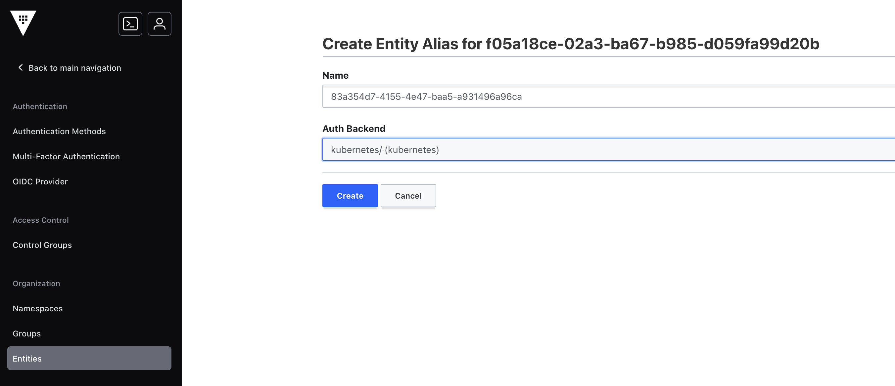
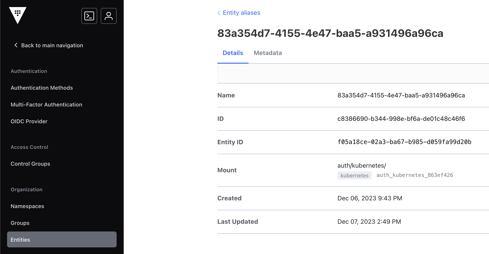

# [Entity Alias] Vault Auth - Kubernetes

## Background
[**Entity Aliasing**](https://developer.hashicorp.com/vault/docs/concepts/identity#entities-and-aliases) allows for the same user, application, or workflow utilizing multiple Vault Authentication methods or accounts to be associated with the same [Vault Identity Entity](https://developer.hashicorp.com/vault/docs/concepts/identity#entities-and-aliases).  

The [examples given in this tutorial](https://developer.hashicorp.com/vault/tutorials/auth-methods/identity#create-an-entity-with-alias) consists of a pair of User/Pass Auth Mounts but other Auth Methods are missing.

## Entity Alias Considerations

- **Key Attribute**: To create an Alias for a specific Auth Method, some sort of key identifying attribute must be utilized.
- "**Name**": That above attribute must then have a value defined to map to the "**Name**" input value.

## Auth: Kubernetes
- **Key Attribute**: `alias_name_source`
- **Name**: It depends (see below)

For Kubernetes Auth Method, the key attribute is [alias_name_source](https://developer.hashicorp.com/vault/api-docs/auth/kubernetes#alias_name_source):

> (string: "`serviceaccount_uid`") - Configures how identity aliases are generated. Valid choices are: `serviceaccount_uid`, serviceaccount_name When `serviceaccount_uid` is specified, the machine generated UID from the service account will be used as the identity alias name. When serviceaccount_name is specified, the service account's namespace and name will be used as the identity alias name e.g vault/vault-auth. While it is strongly advised that you use `serviceaccount_uid`, you may also use `serviceaccount_name` in cases where you want to set the alias ahead of time, and the risks are mitigated or otherwise acceptable given your use case. It is very important to limit who is able to delete/create service accounts within a given cluster. See the [Create an Entity Alias](https://developer.hashicorp.com/vault/api-docs/secret/identity/entity-alias#create-an-entity-alias) document which further expands on the potential security implications mentioned above.

Please refer to the [~/README.md](README.md) in this Repo or this [documentation](https://developer.hashicorp.com/vault/docs/auth/kubernetes) for the Vault Kubernetes Auth information.

Steps:
- Harvest Service Account `serviceaccound_uid` or `serviceaccount_name`
  ```shell
  kubectl get serviceaccount {{SERVICE ACCOUNT NAME}} -o json | jq
  {
    "apiVersion": "v1",
    "kind": "ServiceAccount",
    "metadata": {
      "creationTimestamp": "2023-12-07T04:00:32Z",
      "name": "vault-auth",
      "namespace": "default",
      "resourceVersion": "6463355",
     "uid": "83a354d7-4155-4e47-baa5-a931496a96ca"
    }
  }
  ```
- Save the `uid` or `metadata/name` values
- In the GUI (Vault `cli` or API methods are also valid), the Entity Alias addition would require either of the above `uid` or `metadata/name` value to be input into the `Name` portion for the Kubernetes Auth method.

[](assets/vault-kubernetes-auth_alias.01.20231207.png)

[](assets/vault-kubernetes-auth_alias.02.20231207.png)
